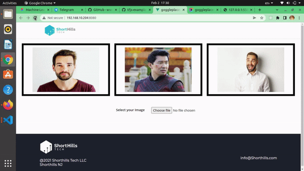

<h1 align="center">
    <b>Goggle Placement</b> 
<br>
</h1>

## What is this for?
This is a Machine learning Repository which mainly focuses on predecting the human face using npm package ```@tensflow/blazeface```. 

## Models and technologies used.

BlazeFace is a lightweight and well-performing face detector tailored for mobile GPU inference. It runs at a speed of 200-1000+ FPS on flagship devices. This super-realtime performance enables it to be applied to any augmented reality pipeline that requires an accurate facial region of interest as an input for task-specific models, such as 2D/3D facial keypoint or geometry estimation, facial features or expression classification, and face region segmentation

## Links to references

Github

https://github.com/tensorflow/tfjs-models/tree/master/blazeface

NPM package

https://www.npmjs.com/package/@tensorflow-models/blazeface

## Vue Installation

Clone the Application on your local system.
After cloning the application on your local system use ```cd Goggle-Placement``` command to go to the Goggle Placement Directory 

Install the default dependencies by running the following command.


```npm install```


## To start your Local server


```npm run serve```


## Sample video





## Contributing

If you want to contribute to a project and make it better, your help is very welcome. Contributing is also a great way to learn more about social coding on Github, new technologies and and their ecosystems and how to make constructive, helpful bug reports, feature requests and the noblest of all contributions: a good, clean pull request.


